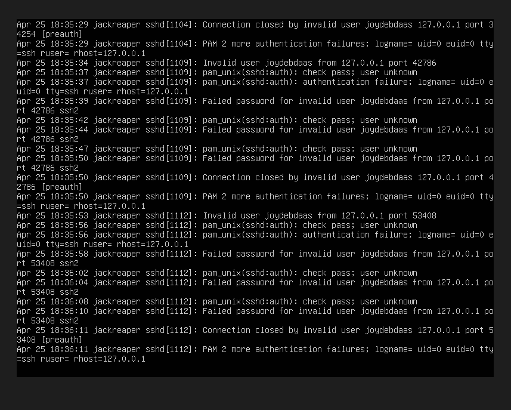
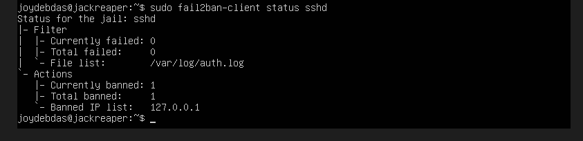

# SSH Brute Force Detection Lab

## Objective
Detect and block SSH brute-force attacks using fail2ban.

## tool used
- open SSH
- Fail2ban
- Ubuntu Server

## Description
This project simulates SSH brute-force attacks and demonstrates automated IP blocking using fail2ban

## COnfiguration steps

### 1. Enabled SSH Password Authentication
Configured SSH to allow password-dased login attempts for testing.

### 2. Simulated Brite force Attack
Used repeated failed SSh login Attempts:
ssh joydebdaas@localhost

### 3. Monitored Logs
sudo tail -f /var/log/auth.log

observed:
Failed password for joydebdaas from 127.0.0.1

### 4. Configured Fail2ban
/etc/fail2ban/jail.local
configuration:
[sshd]
enabled = true
port = ssh
filter = sshd
backend = polling
logpath = /var/log/auth.log
maxretry = 2
bantime = 600
findtime = 60

### 5. verified IP blocking
sudo fail2ban-clent status sshd

## screenshots

### failed login attempts

### IP banned by fail2ban

## note
Due to testing in a locolhost environment,automatic triggering may require multiple rapid failed attempts. Manual verification confirmed that fail2ban successfully blocks malicious IPs.

## outcome
- Successfully detected ssh brute-force attempts
- Implemented automated IP blocking
- Strengthened server security

## skills Demonstrated
- Linux Administration
- log analysis
- Intrusion Prevention
- Cybersecurity Fundamentals

